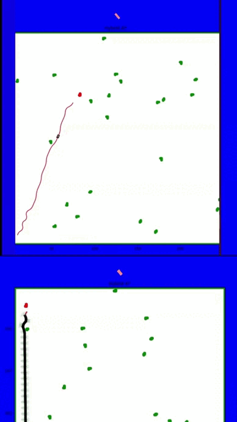
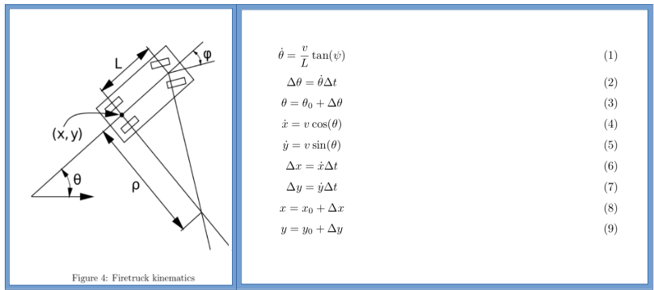

# Wildfire
This repository showcases the implementation of an A* combinatorial planner and a Probabilistic Roadmap (PRM) sampling-based planner for navigating a firetruck and an arsonist Wumpus through a cluttered environment with burning obstacles. The objective was to evaluate and compare the performance of these two motion planning methods in terms of computational efficiency, path optimality, and their overall effectiveness in firefighting scenarios.

# Method
The environment was a 250m x 250m field with 10% coverage of randomly generated tetromino obstacles. The firetruck and Wumpus started at opposite corners, with the Wumpus navigating a grid using A* to reach and ignite adjacent obstacles. Fire dynamics were modeled so that burning obstacles would ignite all obstacles within a 30m radius after 10 seconds. The firetruck used a precomputed PRM roadmap to plan kinodynamically feasible paths to burning obstacles and could extinguish them by remaining stationary within a 10m radius for 5 seconds. Five simulations, each lasting 3600 seconds, were conducted for both planners.

The performance metrics assessed included the ratio of intact obstacles, burned obstacles, extinguished obstacles, and the total computation time for each planner. The Wumpus aimed to ignite the nearest unburned obstacle, while the firetruck prioritized extinguishing the most dangerous fires based on a heuristic that considered the number of nearby intact obstacles.

## Vehicles and Kinematics

Our robot employs an Ackermann steering configuration, modeled after the Mercedes Unimog, a robust off-road vehicle. For the kinematic model, we assume control over the drive wheels' velocity \( v \) and the steering wheels' direction \( \psi \). The steering angle is constrained to ±60°, and we aim to maintain a speed of 10 m/s (approximately 22 mph). The vehicle's wheelbase \( L \) is set at 2.8 meters.

## Conclusion
The grid-based A* planner achieved faster computation times but exhibited less effective firefighting capabilities compared to the PRM sampling-based method. While the pre-computed roadmap offered an advantage, the firetruck's movements were still restricted by the roadmap's topology. The Wumpus's straightforward goal planning efficiently spread fires, but more advanced threat prioritization could enhance the firetruck's response. Overall, the simulation highlighted the trade-offs between combinatorial and sampling-based planners in terms of path optimality, computational complexity, and dynamic replanning abilities.
